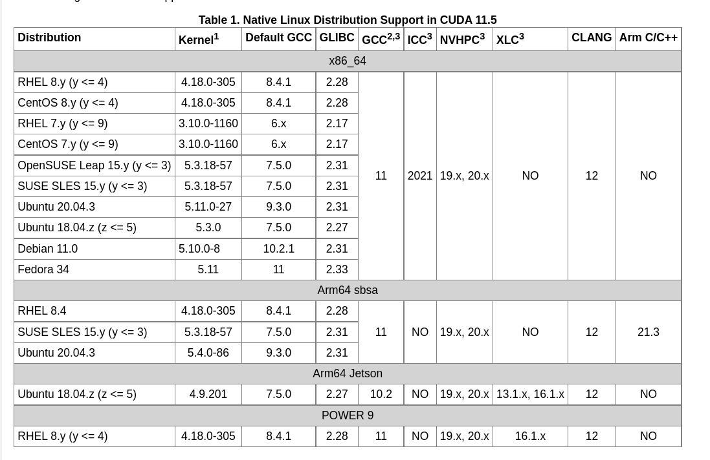
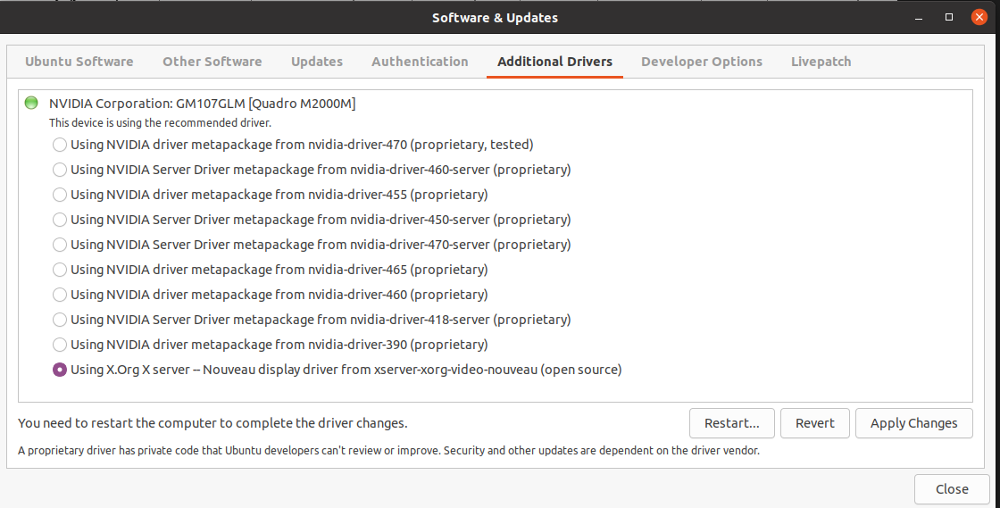
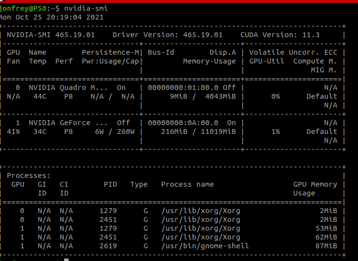

# Setting up the EGPU

1. Check your installed Kernel Version ```find /boot/vmli*``` ```uname -r ```
2. List all available kernels: ```dpkg --list | grep linux-image```    
Correct Kernel needed is specified in the CUDA Library Toolkit Documentation Table   
   
```
sudo apt install linux-image-5.8.0-50-generic linux-hwe-5.8-source-5.8.0 linux-modules-5.8.0-50-generic linux-hwe-5.8-tools-5.8.0-50 linux-modules-extra-5.8.0-50-generic
``` 
3. Switch to the default monitor driver | `START` | `Additional drivers` | `Nouveau` (usually last one in list)
     
4. Uninstall all nvidia fun:
```
sudo apt-get purge --auto-remove nvidia-cuda-toolkit
sudo apt-get purge *nvidia*
sudo apt-get purge *cuda*
sudo apt autoremove
sudo apt upgrade
sudo apt update
```
This will screw up all your installations, so check the uninstalled packages first.   
Additionally you can reset your X11 config:  
```
sudo rm /etc/X11/xorg.conf
```
Magic command that will add nouveau to the default drivers loaded. Not sure if this is doing anything, loaded, or overwritten somewhere else:     
```
echo 'nouveau' | sudo tee -a /etc/modules
```

5. Restart your computer!!! WARNING if you skip this step it fails for me!

6. For me using the EGPU worked with `11.3.1` and `Ubuntu 20.04` `Kernel 5.8.0-50` and the `PyTorch 1.10`
Install it as follows:  
[https://developer.nvidia.com/cuda-11-3-1-download-archive?target_os=Linux&target_arch=x86_64&Distribution=Ubuntu&target_version=20.04&target_type=deb_local]()
```
wget https://developer.download.nvidia.com/compute/cuda/repos/ubuntu2004/x86_64/cuda-ubuntu2004.pin
sudo mv cuda-ubuntu2004.pin /etc/apt/preferences.d/cuda-repository-pin-600
wget https://developer.download.nvidia.com/compute/cuda/11.3.1/local_installers/cuda-repo-ubuntu2004-11-3-local_11.3.1-465.19.01-1_amd64.deb
sudo dpkg -i cuda-repo-ubuntu2004-11-3-local_11.3.1-465.19.01-1_amd64.deb
sudo apt-key add /var/cuda-repo-ubuntu2004-11-3-local/7fa2af80.pub
sudo apt-get update
sudo apt-get -y install cuda 
```
   This will install CUDA and the correct GPU driver.  
   
7. Plug in the EGPU
8. START` | `Thunderbold Manage Thunderbold Devices` -> Make sure devices are connected
9. Follow EGPU switcher instructions [https://github.com/hertg/egpu-switcher]()  
   For me, it helped to specify the internal and external preferred GPU. 
10.   Reboot and enjoy  
  
